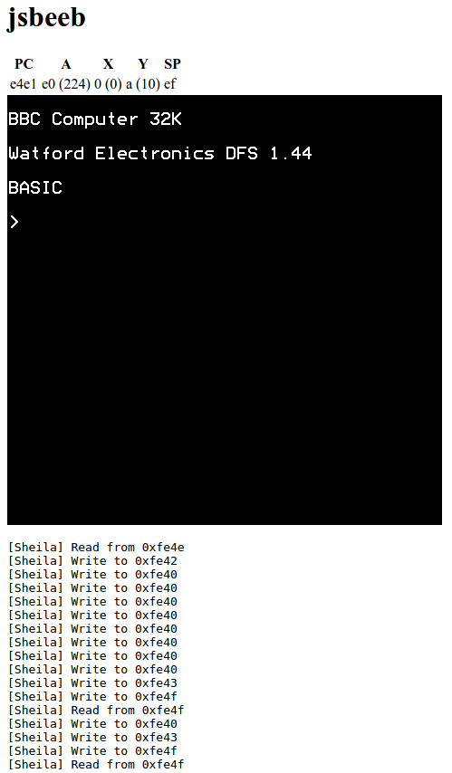

# jsbeeb

A partial implementation of a BBC Micro, written in CoffeeScript. The 6502
CPU emulation seems to work fine, and enough of Sheila for paged ROMs to work.
Display is mode 7 (plain text only), and there's no other I/O yet. In other
words, it's not very useful.

